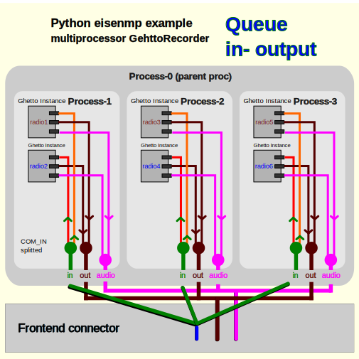
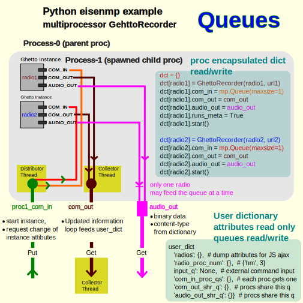

README
#######################

.. image:: https://github.com/44xtc44/eisenmp_examples/actions/workflows/tests.yml/badge.svg
   :target: https://github.com/44xtc44/eisenmp_examples/actions/workflows/tests.yml

Python 3.7 `Multiprocess <https://en.wikipedia.org/wiki/Multiprocessing>`_
`Framework <https://en.wikipedia.org/wiki/Software_framework>`_ for single Server

Command line
------------

Executable script in Python Path::

    $ eisenmp_url  # Ajax web frontend
    $ eisenmp_menu  # command line menu options

Python package call::

    $ python3 -m eisenmp_examples.url  # Ajax web frontend
    $ python3 -m eisenmp_examples.cmd  # command line menu options

Examples
--------

GhettoRecorder Package
~~~~~~~~~~~~~~~~~~~~~~

Brute force
~~~~~~~~~~~
::

    .. read wordlist .\lang_dictionaries\ger\german.dic
    .. read wordlist .\lang_dictionaries\eng\words.txt
    [BRUTE_FORCE]
    cfhhilorrs
    Create processes. Default: proc/CPU core
    0 1 2 3 4 5 6 7 8 9 10 11 12 13 14 15

    ... proc Process-7 ... rohrschilf
    ... proc Process-14 ... rohrschilf
    ... proc Process-16 ... rohrschilf
    ... proc Process-7 ... rohrschilf
    ... proc Process-13 ... schilfrohr
    ... proc Process-13 ... schilfrohr
    ... proc Process-11 ... schilfrohr
    ... proc Process-11 ... schilfrohr

    generator empty, run time iterator 5 seconds

    exit WORKER 15
    exit WORKER 16
    exit WORKER 2
    exit WORKER 10
    exit WORKER 11
    exit WORKER 12
    exit WORKER 8
    exit WORKER 3
    exit WORKER 4
    exit WORKER 6
    exit WORKER 14
    exit WORKER 5
    exit WORKER 7
    exit WORKER 13
    exit WORKER 1
    exit WORKER 9

    --- Result for [CFHHILORRS]---

     rohrschilf

     schilfrohr

    --- END ---

    Processes are down.
    BF Time in sec: 12

    Process finished with exit code 0

Brute Force
    We use an english (.6M) plus a german (2M) wordlist and make a dictionary of it. To gain more read speed.

    len(str) <=  11, combined brute force dictionary attack with a permutation generator. itertool prod. duplicates
    Permutation lists grow very fast, reaching Terabyte size.

    len(str) >=  12, pre reduce a len(str) list. Kick out words which are not matching char type and count.

Web download a large list
    Calculates the average for one column.
    Python CSV extracts the column and we calculate the average with the assigned number
    of Porcesses/CPU cores. It can be more processes than CPU cores, if it makes sense.

large lists
    https://www.stats.govt.nz/large-datasets/csv-files-for-download/ Crown copyright ©.
    All material Stats NZ produces is protected by Crown copyright.
    Creative Commons Attribution 4.0 International licence.

German dict
    https://sourceforge.net/projects/germandict/. License Public Domain

English dict
    Copyright (c) J Ross Beresford 1993-1999. All Rights Reserved.

ORM Flask-SQLAlchemy
     https://pypi.org/project/Flask-SQLAlchemy-Project-Template/ License MIT 44xtc44

Cheers
